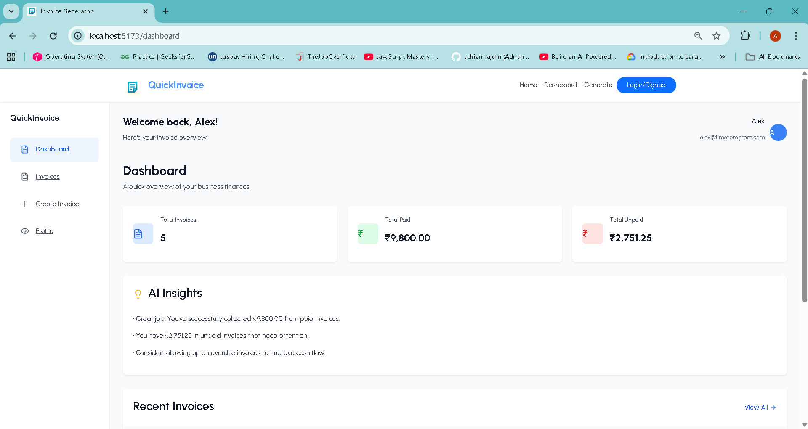

<p align="center">
  
</p>
# QuickInvoice - Professional Invoice Generator

A modern, user-friendly React application for creating and managing professional invoices. Built with React 19, Vite, and Bootstrap, this application provides a seamless experience for freelancers and small businesses to generate, customize, and download invoices.

## Features

- **Multiple Invoice Templates**: Choose from 10+ professionally designed invoice templates
- **Real-time Preview**: See your invoice as you build it with live preview functionality
- **PDF Generation**: Export invoices as high-quality PDF documents using jsPDF and html2canvas
- **User Authentication**: Secure user management with Clerk authentication
- **Responsive Design**: Fully responsive interface built with Bootstrap 5
- **Form Validation**: Comprehensive client-side validation with error handling
- **Logo Upload**: Add custom company logos to invoices
- **Tax Calculations**: Automatic tax and total calculations
- **Toast Notifications**: User-friendly feedback with react-toastify
- **Clean Dashboard**: Intuitive dashboard for managing invoices

## Tech Stack

- **Frontend Framework**: React 19.2.0
- **Build Tool**: Vite 7.2.2
- **Styling**: Bootstrap 5.3.8 + Custom CSS
- **Routing**: React Router DOM 7.9.5
- **Authentication**: Clerk React 5.55.0
- **PDF Generation**: jsPDF 3.0.3 + html2canvas 1.4.1
- **HTTP Client**: Axios 1.13.2
- **Icons**: Bootstrap Icons + Lucide React
- **Notifications**: React Toastify + React Hot Toast + Sonner

## Project Structure

```
src/
├── assets/           # Static assets (images, logos, template previews)
├── components/       # Reusable React components
│   ├── templates/    # Template-specific components
│   ├── InvoiceForm.jsx
│   ├── InvoicePreview.jsx
│   ├── MenuBar.jsx
│   └── TemplateGrid.jsx
├── context/          # React Context for state management
│   └── AppContext.jsx
├── pages/            # Main application pages
│   ├── LandingPage/  # Marketing landing page
│   ├── Dashboard.jsx # User dashboard
│   ├── MainPage.jsx  # Invoice creation interface
│   ├── PreviewPage.jsx # Invoice preview and download
│   └── Profile.jsx   # User profile management
├── templates/        # Invoice template components (Template1-10)
├── util/            # Utility functions
│   └── formatInvoiceData.js
└── App.jsx          # Main application component
```

## Key Components

### Invoice Templates
The application includes 10 distinct invoice templates, each with:
- Unique styling and layout
- Customizable branding elements
- Professional typography and spacing
- Responsive design for various screen sizes

### State Management
Centralized state management using React Context API:
- Invoice data management
- Template selection
- Form validation
- Loading states and error handling

### User Experience
- **Landing Page**: Marketing page showcasing features and benefits
- **Dashboard**: Central hub for invoice management
- **Invoice Builder**: Step-by-step invoice creation process
- **Preview & Download**: Real-time preview with PDF export functionality

## Getting Started

### Prerequisites
- Node.js (v16 or higher)
- npm or yarn package manager

### Installation

1. Clone the repository:
```bash
git clone <repository-url>
cd invoice-generator-client
```

2. Install dependencies:
```bash
npm install
```

3. Start the development server:
```bash
npm run dev
```

4. Open your browser and navigate to `http://localhost:5173`

### Available Scripts

- `npm run dev` - Start development server with hot reload
- `npm run build` - Build the application for production
- `npm run preview` - Preview the production build locally
- `npm run lint` - Run ESLint for code quality checks

## Configuration

### Environment Setup
The application uses Clerk for authentication. Set up your Clerk configuration:

1. Create a Clerk account and project
2. Configure your Clerk publishable key
3. Set up authentication flows as needed

### Customization
- **Templates**: Add new templates in the `src/templates/` directory
- **Styling**: Modify Bootstrap variables or add custom CSS
- **Components**: Extend functionality by adding new components

## Responsive Design

The application is fully responsive and optimized for:
- Desktop computers (1200px+)
- Tablets (768px - 1199px)
- Mobile devices (320px - 767px)

## Security Features

- Secure authentication with Clerk
- Client-side form validation
- Input sanitization
- Secure PDF generation

## UI/UX Features

- Modern, clean interface design
- Intuitive navigation and user flow
- Interactive elements with hover effects
- Professional color scheme and typography
- Accessibility considerations

## License

This project is private and proprietary. All rights reserved.

## Contributing

This is a private project. For internal development guidelines, please refer to the team documentation.

---

**Built with React + Vite**
